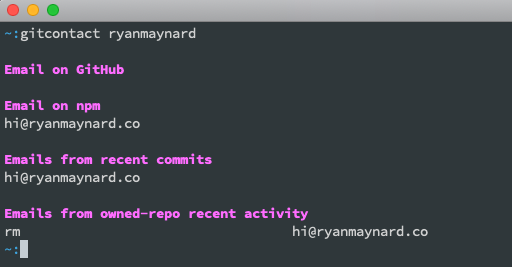

# GitContact

Attempts to find a github user's email

### Installation

`npm install -g gitcontact`

In order to use the github API, you will need to generate an API token. 
To do so, open `https://github.com/settings/tokens/new?description=gitcontact`.
Leave the boxes unchecked and generate a token. 
Afterward, you will need to run
`export GH_EMAIL_TOKEN=<token>`. You will also need to add it to your .bashrc or .bash_profile so that it loads in subsequent sessions. 

###  Usage

`gitcontact user`

### Contributing

Fork it:
`https://github.com/ryanmaynard/gitcontact/fork`

Create your feature branch:
`git checkout -b my-new-feature`

Commit your changes:
`git commit -am 'Add some feature'`

Push to the branch:
`git push origin my-new-feature`

Create a new Pull Request:
`https://github.com/ryanmaynard/gitcontact/compare`

### License

* [MIT TLDR][mit]
* [License Text][license]

[mit]: https://tldrlegal.com/license/mit-license
[license]: https://github.com/ryanmaynard/gitcontact/blob/master/LICENSE